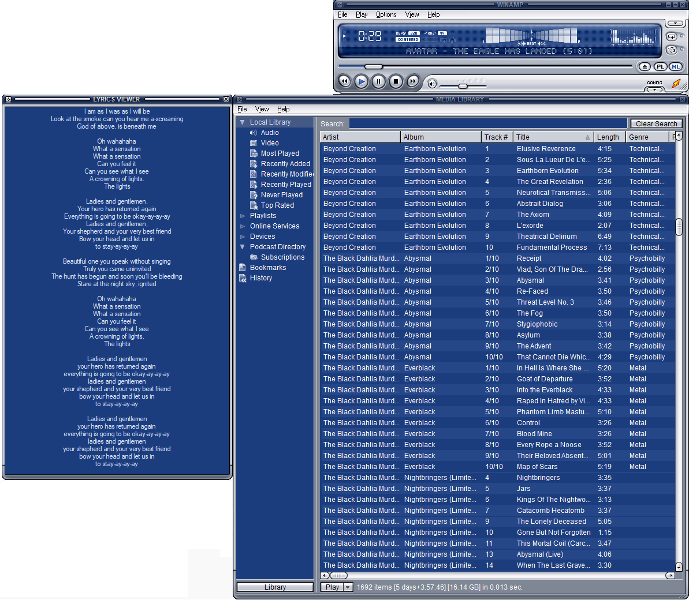

# Lyric Finder Winamp Plugin
Simple plugin for displaying a new window containing lyrics fetched from online sources.
Only tested for classical skin and might not work for any other skin.

Supports:
 * Fetching lyrics from online sources
 * Displaying lyrics in child window
   - Resizable
   - Changes color based on theme

TODO:
- [ ] Make child window scrollable.
  - Is unstable if enabled.
- [x] Extend LyricsAPI to fetch from more sources.
 * darklyrics.com
 * songlyrics.com
- [ ] Fix all bugs

## BUGS
Some known bugs:
 - Sometimes crashes due to some synchronization issue.

## Visuals
Supports visuals from Winamp modern with different color schemes.

